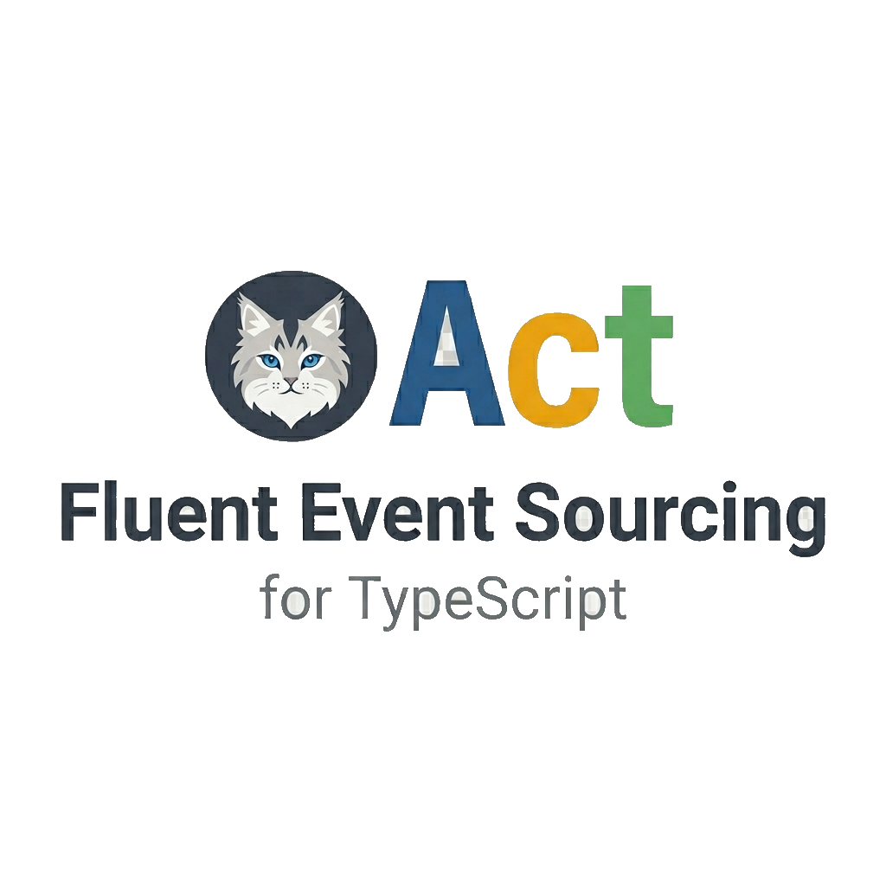

<table width="100%" cellspacing="0" cellpadding="0" style="border-collapse:collapse;border-spacing:0;margin:0;padding:0">
  <tr>
    <td colspan="2" align="left" style="padding:0">
      <a href="https://github.com/rotorsoft/act-root/actions/workflows/ci-cd.yml"></a>
      <a href="https://github.com/rotorsoft/act-root/actions/workflows/conformance.yml"></a>
      <a href="https://coveralls.io/github/Rotorsoft/act-root?branch=master"></a>
      
    </td>
  </tr>
  <tr>
    <td width="69%" align="center" style="padding:0">
      <a href="https://rotorsoft.github.io/act-root/">
        
      </a>
    </td>
    <td width="31%" align="center" style="padding:0">
      <a href="https://payhip.com/b/7ezLy">
        
      </a>
    </td>
  </tr>
  <tr>
    <td align="center" style="padding:0">
      <a href="https://rotorsoft.github.io/act-root/docs/intro"></a>
      <a href="https://rotorsoft.github.io/act-root/"></a>
    </td>
    <td align="center" style="padding:0">
      <a href="https://payhip.com/b/7ezLy"></a>
    </td>
  </tr>
</table>

## What it is

Act is an event-sourcing framework for TypeScript. The domain is expressed through three composable primitives: actions, state, and reactions. An action validates input against a Zod schema, commits one or more events under optimistic concurrency, and reduces them into derived state via a patch handler. Reactions fire on commit, drain in order, retry under back-pressure, and surface to the operator when something downstream wedges. The framework wires the rest of the pipeline: snapshots and a cache layer for fast cold loads, correlation across stream boundaries, a recovery API for blocked streams, time-travel queries against the same log. Pick a store at bootstrap. Postgres for production, SQLite for embedded, in-memory for tests. The application code stays the same.

```
   ┌─────────────┐    action     ┌─────────────────┐    reaction      ┌──────────────┐
   │             │ ────────────► │       Act       │ ───────────────► │              │
   │   client    │               │  events, state, │                  │  downstream  │
   │             │ ◄──────────── │  drain, recover │                  │              │
   └─────────────┘    load()     └─────────────────┘                  └──────────────┘
```

The primitives:

| | |
|---|---|
| Action | The change you want to make. Validated against a Zod schema, emitted as one or more immutable events, committed under optimistic concurrency. |
| State | The data you care about. Defined as a Zod schema, evolved by emit-and-patch, served back through `load()` with snapshot and cache layers in front of replay. |
| Reaction | What happens as a result. Fires in commit order, retried under back-pressure with configurable backoff, blocked-stream surfaced to operators when a downstream wedges. |

## 30-second demo

```ts
import { act, state } from "@rotorsoft/act";
import { z } from "zod";

const Counter = state({ Counter: z.object({ count: z.number() }) })
  .init(() => ({ count: 0 }))
  .emits({ Incremented: z.object({ amount: z.number() }) })
  .patch({ Incremented: ({ data }, s) => ({ count: s.count + data.amount }) })
  .on({ increment: z.object({ by: z.number() }) })
  .emit((action) => ["Incremented", { amount: action.by }])
  .build();

const app = act().withState(Counter).build();
await app.do("increment", { stream: "c1", actor: { id: "1", name: "u" } }, { by: 5 });

const snap = await app.load(Counter, "c1");
console.log(snap.state); // { count: 5 }
```

## What's in the box

| | |
|---|---|
| Production stores | Postgres, SQLite, and in-memory all pass the same `runStoreTck`. Application code doesn't change between them; only the bootstrap line differs. |
| Zod end to end | Schemas define every action, event, and state shape at runtime and generate the TypeScript types at compile time. One source of truth, full inference into reducers, projections, and queries. |
| No external broker | The event store carries the message-bus role. Postgres exposes cross-process wakeups via `LISTEN`/`NOTIFY`; the orchestrator falls back to a polling debounce when the hook isn't there, so correctness is preserved either way. |
| HTTP integrations | Outbound `webhook` reaction helper with auto Idempotency-Key, status-classified retries, and a published receiver-side dedup contract. SSE for incremental state broadcast lives on the same subpath. |
| Live inspector | A web app you point at any Act store. Browse the event log, watch correlation and drain in real time, inspect blocked streams, page through subscription positions. |
| Interactive diagrams | An SVG of the domain model with click-through to source, plus the `act` CLI that walks the same content in the terminal. |
| Time-travel | `app.load(State, id, _, { before: N })` reconstructs state at any historical event id or timestamp through the same call you use for the current state. |
| Recovery loop | `app.blocked_streams()` surfaces what's wedged. `app.unblock(...)` resumes from the watermark without replaying history; `app.reset(...)` rebuilds projections from scratch. |
| AI scaffolding | The bundled Claude Code skill turns a functional spec into a working monorepo. Domain, tRPC API, React client, vitest. |

## Packages

### Core

| Package | Description |
|---|---|
| [@rotorsoft/act](https://github.com/rotorsoft/act-root/tree/master/libs/act)<br>[](https://www.npmjs.com/package/@rotorsoft/act)&nbsp;[](https://www.npmjs.com/package/@rotorsoft/act) | The framework. State, actions, reactions, slices, projections, the correlate / drain / settle loop, snapshots, cache, recovery. Zod-typed end to end. |
| [@rotorsoft/act&#x2011;pg](https://github.com/rotorsoft/act-root/tree/master/libs/act-pg)<br>[](https://www.npmjs.com/package/@rotorsoft/act-pg)&nbsp;[](https://www.npmjs.com/package/@rotorsoft/act-pg) | Postgres store. Atomic stream claiming via `FOR UPDATE SKIP LOCKED`, connection pooling, optional `LISTEN`/`NOTIFY` for cross-process wakeups. |
| [@rotorsoft/act&#x2011;sqlite](https://github.com/rotorsoft/act-root/tree/master/libs/act-sqlite)<br>[](https://www.npmjs.com/package/@rotorsoft/act-sqlite)&nbsp;[](https://www.npmjs.com/package/@rotorsoft/act-sqlite) | libSQL store for single-node and edge deployments. |
| [@rotorsoft/act&#x2011;patch](https://github.com/rotorsoft/act-root/tree/master/libs/act-patch)<br>[](https://www.npmjs.com/package/@rotorsoft/act-patch)&nbsp;[](https://www.npmjs.com/package/@rotorsoft/act-patch) | Immutable deep-merge patch utility used by state reducers. Zero dependencies, browser-safe. |

### Integrations

| Package | Description |
|---|---|
| [@rotorsoft/act&#x2011;http](https://github.com/rotorsoft/act-root/tree/master/libs/act-http)<br>[](https://www.npmjs.com/package/@rotorsoft/act-http)&nbsp;[](https://www.npmjs.com/package/@rotorsoft/act-http) | Outbound `webhook` helper with auto Idempotency-Key, status-classified retries, and a published receiver-side dedup contract. The `/sse` subpath broadcasts incremental state to live UIs. |
| [@rotorsoft/act&#x2011;pino](https://github.com/rotorsoft/act-root/tree/master/libs/act-pino)<br>[](https://www.npmjs.com/package/@rotorsoft/act-pino)&nbsp;[](https://www.npmjs.com/package/@rotorsoft/act-pino) | Pino logger adapter for transports, redaction, async sinks. |
| [@rotorsoft/act&#x2011;diagram](https://github.com/rotorsoft/act-root/tree/master/libs/act-diagram)<br>[](https://www.npmjs.com/package/@rotorsoft/act-diagram)&nbsp;[](https://www.npmjs.com/package/@rotorsoft/act-diagram) | Interactive SVG of the domain model with click-through to source. Also ships the `act` CLI for the same content in the terminal. |
| [@rotorsoft/act&#x2011;tck](https://github.com/rotorsoft/act-root/tree/master/libs/act-tck)<br>[](https://www.npmjs.com/package/@rotorsoft/act-tck)&nbsp;[](https://www.npmjs.com/package/@rotorsoft/act-tck) | Executable conformance kit for Store, Cache, and Logger ports. Third-party adapters validate themselves against it. |

### Workspace apps (not on npm)

| Package | Description |
|---|---|
| [@rotorsoft/act&#x2011;inspector](https://github.com/rotorsoft/act-root/tree/master/packages/inspector) | Web app you point at any Act store. Browse the event log, watch correlation and drain in real time, inspect blocked streams, page through subscription positions. |

## AI-assisted scaffolding

The repo ships a [Claude Code](https://claude.ai/code) skill at [`.claude/skills/scaffold-act-app`](./.claude/skills/scaffold-act-app/). Drop a functional spec into Claude Code and ask it to build the app: event-modeling diagrams, event-storming boards, JSON configs, user stories, and prose all work. The skill maps the spec's vocabulary into framework concepts (aggregates into states, commands into actions, policies into reactions, read models into projections), scaffolds the monorepo, and walks the build process end to end with production guidance for Postgres, background processing, automated jobs, and error handling.

To install:

```sh
# In the project root
mkdir -p .claude/skills
cp -r /path/to/act-root/.claude/skills/scaffold-act-app .claude/skills/

# Or globally for all your projects
cp -r /path/to/act-root/.claude/skills/scaffold-act-app ~/.claude/skills/
```

Then ask Claude Code: **"Build me an app from this spec: `<link-or-file>`"**.

## Quality signals

100% statement, branch, function, and line coverage on every PR. Property-based tests cover commit version monotonicity, claim/lease lifecycle, cache/store coherence, correlate→drain delivery exactness, and close idempotency. A CI bench fails the build when any scenario's p50 regresses past 1.5× the checked-in baseline; numbers are in [PERFORMANCE.md](./libs/act/PERFORMANCE.md). The three in-tree stores (Postgres, SQLite, InMemory) pass the same [TCK](./libs/act-tck) and the [conformance workflow](https://github.com/rotorsoft/act-root/actions/workflows/conformance.yml) runs on every PR. Public API stability is governed by [STABILITY.md](./STABILITY.md): breaking changes require an explicit `BREAKING CHANGE:` footer and a written migration note.

## Documentation

- [Get started](https://rotorsoft.github.io/act-root/docs/intro) — walkthrough from install to a working app
- [Concepts](https://rotorsoft.github.io/act-root/docs/intro) — state management, event sourcing, error handling, real-time, testing, configuration
- [Architecture](https://rotorsoft.github.io/act-root/docs/architecture) — concurrency model, cache and snapshots, correlation and drain, cross-process reactions, priority lanes, close cycle, schema evolution, extension points
- [Guides](https://rotorsoft.github.io/act-root/docs/intro) — production checklist, projections to a database, external integration, writing a custom store/cache/logger, contributing a new package
- [API reference](https://rotorsoft.github.io/act-root/docs/api/) — typedoc, refreshed on every push to `master`
- [Performance](./libs/act/PERFORMANCE.md) — throughput numbers per store, CI regression guard, optimization history
- [Philosophy](./docs/PHILOSOPHY.md) — DDD / Event Sourcing / CQRS lineage, integration patterns, why this shape
- [The book](https://payhip.com/b/7ezLy) — _Practical Event Sourcing in TypeScript_, Event Sourcing / CQRS / DDD applied end to end through a multiplayer Risk game

## Examples

- [Calculator](./packages/calculator/src/) — actions are key presses, a digit board tracks how many times each digit has been pressed. The hello-world for the framework.
- [WolfDesk](./packages/wolfdesk/src/) — reference implementation of the WolfDesk ticketing system from Vlad Khononov's [_Learning Domain-Driven Design_](https://a.co/d/1udDtcE). Multi-slice domain, real workflows, blocked-stream recovery, webhook integration.
- [tRPC client + server](./packages/server/src/) — exposes the calculator as a web app. The shape the AI-scaffolding skill produces.

## Contributing

Fork, branch, install (`pnpm install`), test (`pnpm test`), lint (`pnpm lint`), commit, push, PR. Conventional commits. 100% coverage gate. The full pre-handoff workflow lives in [CLAUDE.md](./CLAUDE.md); the per-package contributing guide is in [docs/docs/guides/contributing-new-package.md](./docs/docs/guides/contributing-new-package.md). Open an issue or join [GitHub Discussions](https://github.com/rotorsoft/act-root/discussions) for questions.

## Versioning

[SemVer](https://semver.org/). What semver protects and what it doesn't is in [STABILITY.md](./STABILITY.md); release notes and breaking changes are in [CHANGELOG.md](./CHANGELOG.md).

## License

MIT
