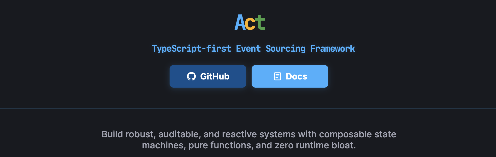

[](https://coveralls.io/github/Rotorsoft/act-root?branch=master)


[](https://rotorsoft.github.io/act-root/)

[](https://payhip.com/b/7ezLy)

The complexity of modern software design often arises from over-engineering abstractions and paradigms that, while powerful, can be difficult to grasp and apply coherently. This project is an attempt to distill the basic building blocks of modern software design into a small, simple, and composable library.

## Libraries

### [@rotorsoft/act](https://github.com/rotorsoft/act-root/tree/master/libs/act)
[](https://www.npmjs.com/package/@rotorsoft/act)
[](https://www.npmjs.com/package/@rotorsoft/act)

### [@rotorsoft/act-pg](https://github.com/rotorsoft/act-root/tree/master/libs/act-pg)
[](https://www.npmjs.com/package/@rotorsoft/act-pg)
[](https://www.npmjs.com/package/@rotorsoft/act-pg)

### [@rotorsoft/act-sqlite](https://github.com/rotorsoft/act-root/tree/master/libs/act-sqlite)
[](https://www.npmjs.com/package/@rotorsoft/act-sqlite)
[](https://www.npmjs.com/package/@rotorsoft/act-sqlite)

### [@rotorsoft/act-pino](https://github.com/rotorsoft/act-root/tree/master/libs/act-pino)
[](https://www.npmjs.com/package/@rotorsoft/act-pino)
[](https://www.npmjs.com/package/@rotorsoft/act-pino)

### [@rotorsoft/act-patch](https://github.com/rotorsoft/act-root/tree/master/libs/act-patch)
[](https://www.npmjs.com/package/@rotorsoft/act-patch)
[](https://www.npmjs.com/package/@rotorsoft/act-patch)

### [@rotorsoft/act-sse](https://github.com/rotorsoft/act-root/tree/master/libs/act-sse)
[](https://www.npmjs.com/package/@rotorsoft/act-sse)
[](https://www.npmjs.com/package/@rotorsoft/act-sse)

### [@rotorsoft/act-diagram](https://github.com/rotorsoft/act-root/tree/master/libs/act-diagram)
[](https://www.npmjs.com/package/@rotorsoft/act-diagram)
[](https://www.npmjs.com/package/@rotorsoft/act-diagram)

## Tools

### [@rotorsoft/act-inspector](https://github.com/rotorsoft/act-root/tree/master/packages/inspector)

Event sourcing observatory — connect to any Act PostgreSQL store and inspect events in real time. Event log, SVG timeline, stream inspector, correlation explorer, and drain processing monitor with live polling.


---


## `Actions` -> `{ State }` <- `Reactions`

Any system distills into three things:

- **State** — the data you care about
- **Actions** — the changes you want to make to it
- **Reactions** — what happens as a result

Act takes those three primitives seriously: Zod schemas as the source of truth, immutable events as the audit trail, and a built-in pipeline that turns reactions into observable workflows.

→ For the why-this-shape rationale (Actor Model lineage, integration patterns, the emergent-complexity argument), see [docs/PHILOSOPHY.md](./docs/PHILOSOPHY.md).

## Design Decisions

Act makes opinionated choices that differ from other event sourcing frameworks. Understanding these decisions helps you work with the framework rather than against it.

### Zod Schemas as the Source of Truth

Every action, event, and state shape is defined with a Zod schema. This gives you runtime validation, TypeScript inference, and a single definition that drives both types and checks. There are no separate type declarations — the schema *is* the type.

### Immutable Events, Versioned Names

Events on disk are never mutated. When schemas evolve in non-breaking ways (adding optional fields), the patch handler provides defaults. When breaking changes are needed (renaming fields, changing types), create a new versioned event name:

```ts
.emits({
  TicketOpened: z.object({ title: z.string(), type: z.string() }),
  TicketOpened_v2: z.object({
    title: z.string(),
    priority: z.enum(["low", "medium", "high"]),
    category: z.string(),
  }),
})
.patch({
  TicketOpened: ({ data }, state) => ({
    ...state, title: data.title, category: data.type, priority: "medium",
  }),
  TicketOpened_v2: ({ data }, state) => ({
    ...state, title: data.title, priority: data.priority, category: data.category,
  }),
})
```

Other frameworks use **upcasting** — loosely-typed transforms that convert old event data at read time. Act rejects this because it erases the type information that Zod provides. Versioned event names keep every schema version explicit in the type system — reducers, projections, and queries all benefit from full TypeScript inference with no `unknown` escape hatches.

### Passthrough by Default

When `.emits()` declares events, every event gets a default passthrough reducer: `({ data }) => data`. Use `.patch()` only for events that need custom logic. Similarly, `.emit("EventName")` passes the action payload directly as event data. This eliminates boilerplate for the common case.

### Projections Are Disposable

Projections are derived data — you should be able to throw one away and rebuild it from the event log at any time. Reset the watermark with `app.reset(["projection-target"])` and the next `app.settle()` replays all events from the beginning. `settle()` loops correlate→drain until a pass makes no progress, so a single call fully catches up paginated streams. `app.reset()` also arms the orchestrator's drain flag, which `store().reset()` alone does not (a settled app would otherwise short-circuit and skip the replay).

### Snapshots and Cache: Two Layers

Cache (in-memory LRU) is checked first on every `load()`, eliminating store round-trips for warm streams. Snapshots (persisted as `__snapshot__` events in the store) are the fallback on cache miss — cold start, LRU eviction, or process restart. Together they keep `load()` fast regardless of stream length.

Every `Snapshot` exposes what just happened on the way to producing it: `cache_hit` (was the read served from cache?), `replayed` (how many events did this load process past the cache point?), and `version` (current head version of the stream). The `load` trace breadcrumb surfaces these inline so operators can see cache effectiveness, replay cost, and stream depth at a glance — see [PERFORMANCE.md](./libs/act/PERFORMANCE.md) for measured throughput numbers.

### Time-Travel via Query Filters, Not a Separate API

The event log is a complete history — `load()` accepts an optional `asOf` parameter to reconstruct state at any point in time. No separate time-travel API; the same `load()` you use for current state works for historical state:

```ts
// State as-of event ID
await app.load(Counter, "counter-1", undefined, { before: 5000 });

// State as-of timestamp
await app.load(Counter, "counter-1", undefined, { created_before: new Date("2025-12-31") });
```

The callback (third parameter) receives each intermediate snapshot during replay, enabling step-through debugging. When `asOf` is present, cache is bypassed and snapshots before the cutoff are used as replay checkpoints.

### Reactions via Drain, Not Pub/Sub

Reactions are processed by polling (`drain()`), not by pub/sub. The store's `claim()` uses `FOR UPDATE SKIP LOCKED` in PostgreSQL for zero-contention competing consumers — workers never block each other. This gives you exactly-once processing semantics, automatic retries, and dead-letter blocking without external infrastructure.

### Static vs Dynamic Stream Discovery

At build time, reaction resolvers are classified as static (known target) or dynamic (function). Static targets are subscribed once at init. Dynamic targets are discovered by `correlate()`, which scans new events and registers target streams. When no dynamic resolvers exist, correlation is skipped entirely — zero overhead.

### Idempotency at the API Layer, Not the Framework

Duplicate request detection is a common need, but it belongs in API middleware — not the event sourcing framework. Framework-level deduplication (checking event metadata before commit) has fundamental holes: TOCTOU races under concurrent retries, semantic overloading of correlation IDs (trace ID vs idempotency key), and no TTL for stale keys.

Act relies on **optimistic concurrency** (`expectedVersion`) for conflict detection at the event store level. For request-level idempotency, use a dedicated cache in your API middleware:

```ts
// tRPC middleware example
const idempotencyKeys = new Map<string, { response: unknown; expiresAt: number }>();

const idempotent = t.middleware(async ({ ctx, next, rawInput }) => {
  const key = (rawInput as any)?.idempotencyKey;
  if (key) {
    const cached = idempotencyKeys.get(key);
    if (cached && cached.expiresAt > Date.now()) return { ok: true, data: cached.response };
  }
  const result = await next({ ctx });
  if (key && result.ok) {
    idempotencyKeys.set(key, { response: result.data, expiresAt: Date.now() + 86_400_000 });
  }
  return result;
});
```

This cleanly separates "has this request been processed?" (API concern with TTL and cache) from "what events exist?" (event store concern with immutable log). Use Redis for distributed deployments.

### Vertical Slices, Not Layers

`slice()` groups a partial state with its reactions into a self-contained feature module. Each slice owns its actions, events, patches, and reaction handlers. Slices compose into the full application via `act().withSlice()`. This keeps related code together instead of scattering it across service/repository/handler layers.

## Quality

- **100% coverage** maintained across statements, branches, functions, and lines for `libs/act` (`pnpm test` runs the full suite with coverage in CI).
- **Property-based tests** (`fast-check`) cover commit version monotonicity, claim/lease lifecycle correctness, cache/store coherence, correlate→drain delivery exactness, and close idempotency. See [`libs/act/test/property/`](./libs/act/test/property/).
- **CI perf regression guard** runs a fast bench suite on every PR and fails when any scenario's p50 exceeds 1.5× the checked-in baseline. Numbers, scenarios, and the baseline-update workflow are in [PERFORMANCE.md](./libs/act/PERFORMANCE.md#ci-regression-guard).

## Quickstart

Install the framework:

```sh
npm install @rotorsoft/act
# or
pnpm add @rotorsoft/act
# or
yarn add @rotorsoft/act
```

Create a minimal app:

```ts
import { act, state } from "@rotorsoft/act";
import { z } from "zod";

const Counter = state({ Counter: z.object({ count: z.number() }) })
  .init(() => ({ count: 0 }))
  .emits({ Incremented: z.object({ amount: z.number() }) })
  .patch({  // optional — only for events needing custom reducers (passthrough is the default)
    Incremented: ({ data }, state) => ({ count: state.count + data.amount }),
  })
  .on({ increment: z.object({ by: z.number() }) })
  .emit((action) => ["Incremented", { amount: action.by }])
  .build();

const app = act().withState(Counter).build();

await app.do(
  "increment",
  { stream: "counter1", actor: { id: "1", name: "User" } },
  { by: 1 }
);
console.log(await app.load(Counter, "counter1"));
```

### Compose with Slices and Projections

Use `slice()` to group partial states with scoped reactions (vertical slice architecture), and `projection()` to build read-model updaters. Use `.withState()`, `.withSlice()`, and `.withProjection()` to compose them:

```ts
import { act, projection, slice } from "@rotorsoft/act";

// Projection — read-model updater, handlers receive (event, stream)
const CounterProjection = projection("counters")
  .on({ Incremented: z.object({ amount: z.number() }) })
    .do(async ({ stream, data }) => { /* update read model */ })
  .build();

// Slice — partial state + scoped reactions, handlers receive (event, stream, app)
// Projections can be embedded in slices when their events are a subset of the slice's events
const CounterSlice = slice()
  .withState(Counter)
  .withProjection(CounterProjection)  // embed projection (events must be subset of slice events)
  .on("Incremented")
    .do(async (event, _stream, app) => { /* dispatch actions via app */ })
    .to("counter-target")
  .build();

// Standalone projections work at the act() level for cross-slice events
const app = act().withSlice(CounterSlice).build();
```

## AI-Assisted Application Scaffolding

Build a complete Act application from a functional specification using [Claude Code](https://claude.ai/code) and the included skill.

### Install the skill

```sh
# Project skill (recommended) — available in this repo
mkdir -p .claude/skills
cp -r /path/to/act-root/.claude/skills/scaffold-act-app .claude/skills/

# Personal skill — available across all projects
cp -r /path/to/act-root/.claude/skills/scaffold-act-app ~/.claude/skills/
```

### Usage workflow

1. Open Claude Code in an empty directory (or your new project root)
2. Tell Claude: **"Build me an app from this spec: `<link-or-file>`"**
3. Claude fetches the spec, identifies the format, and maps domain artifacts to framework concepts
4. Claude scaffolds the monorepo — domain logic, tRPC API, React client, and tests
5. Review, iterate, deploy

Any spec format works: event modeling diagrams, event storming boards, JSON configs, user stories, or plain prose.

### What the skill covers

- **Generic spec parsing** — vocabulary mapping from any modeling tool to framework concepts
- **Spec-to-code mapping** — translates aggregates, commands, events, policies, and read models to framework builders
- **Monorepo template** — complete workspace configuration (pnpm, TypeScript, Vite, Vitest, tRPC, React)
- **10-step build process** — schemas, invariants, states, slices, projections, bootstrap, router, client, tests, dependencies
- **Strict rules** — immutable events, Zod mandatory, actor context, partial patches, causation tracking
- **Production guide** — PostgreSQL store, background processing, automated jobs, error handling

## Documentation

- [API Reference](https://rotorsoft.github.io/act-root/docs/api/) — typedoc-generated, refreshed on every push to `master`
- [Concepts & Guides](https://rotorsoft.github.io/act-root/docs/intro) — domain modeling, state management, error handling, real-time
- [Performance & Benchmarks](./libs/act/PERFORMANCE.md) — throughput numbers per store, CI regression guard, optimization history
- [Philosophy](./docs/PHILOSOPHY.md) — Actor Model lineage, integration patterns, why this shape
- [The Book](https://payhip.com/b/7ezLy) — Event Sourcing / CQRS / DDD applied end-to-end through a multiplayer Risk game
- [Examples](#examples) — calculator, WolfDesk ticketing, tRPC integration

## How to Contribute

We welcome contributions! To get started:

1. **Fork** this repository and clone your fork.
2. **Create a branch** for your feature or fix:

   ```sh
   git checkout -b my-feature
   ```

3. **Install dependencies**:

   ```sh
   pnpm install
   ```

4. **Run tests**:

   ```sh
   pnpm build
   pnpm test
   ```

5. **Lint and format**:

   ```sh
   pnpm lint
   ```

6. **Commit and push** your changes.
7. **Open a Pull Request** on GitHub.

**Code style:**  
We use [ESLint](https://eslint.org/) and [Prettier](https://prettier.io/).

**Questions?**  
Open an issue or join the discussion on [GitHub Discussions](https://github.com/rotorsoft/act-root/discussions).

## Versioning

This project follows [Semantic Versioning (SemVer)](https://semver.org/).  
See [CHANGELOG.md](./CHANGELOG.md) for release notes and breaking changes.

## Examples

To demonstrate the capabilities of this framework, we provide a library of examples with test cases:

### Calculator

The first example is a simple [calculator](./packages/calculator/src/) where actions represent key presses, and a digit board tracks how many times the digits have been pressed in response to events.

### WolfDesk

The second example is a reference implementation of the [WolfDesk](./packages/wolfdesk/src/) ticketing system, as proposed by Vlad Khononov in his book [Learning Domain-Driven Design](https://a.co/d/1udDtcE).

### tRPC Integration

Additionally, we include tRPC-based [client](./packages/client/src/) and [server](/packages/server/src/) packages that outline the basic steps for exposing the calculator as a web application.

Enjoy!
