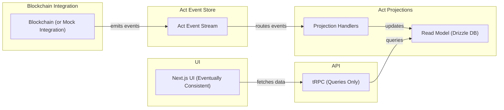

# BetBlox

A blockchain-agnostic, event-driven prediction market platform. Users create and vote on outcome-based polls using their blockchain wallet. All actions are on-chain; the backend listens to events and maintains fast, queryable projections for the UI using Act and Drizzle ORM.

---

## Architecture Diagram



---

## Quick Start

1. **Install prerequisites:**
   - Rust, Solana CLI, Anchor, Node.js, pnpm, Docker (optional)
2. **Clone repo & bootstrap:**
   - `pnpm install`
3. **Start local Solana validator:**
   - `solana-test-validator`
4. **Deploy contract locally:**
   - `anchor build && anchor deploy`
5. **Run backend & frontend:**
   - `pnpm dev` (or separate scripts for each)
6. **Run tests:**
   - `pnpm test` (all packages)
7. **Check code coverage:**
   - `pnpm coverage`
8. **Run migrations:**
   - `pnpm drizzle:migrate`
9. \*\*Connect wallet (Phantom, Solflare) to local/testnet`

---

## Running Frontend & Backend Together

To run both the Next.js frontend and the backend API server at once:

1. **Install dependencies (from the repo root):**

   ```sh
   pnpm install
   ```

2. **Run both servers concurrently:**

   ```sh
   pnpm --filter betblox dev:all
   ```

   - This will start:
     - The backend (Fastify + tRPC) on [http://localhost:4000](http://localhost:4000)
     - The frontend (Next.js) on [http://localhost:3000](http://localhost:3000)

**Note:**

- Ensure you have a valid `DATABASE_URL` environment variable set for Postgres.
- If you see errors about missing dependencies, run `pnpm install` again.
- If you see errors about missing environment variables, set them in your shell or a `.env` file.

---

## Database: Start/Stop with Docker Compose

The local Postgres database for BetBlox is managed with Docker Compose. The compose file is located at `packages/betblox/docker-compose.local.yml`.

- **Start the database:**

  ```sh
  pnpm --filter betblox db:up
  ```

- **Stop the database:**

  ```sh
  pnpm --filter betblox db:down
  ```

This will start/stop a Postgres container with the correct user, password, and database for local development.

- **Create the .env file (if missing):**

  ```sh
  pnpm --filter betblox db:env
  ```

  This will generate a `.env` file in `packages/betblox/` with the correct `DATABASE_URL` for local development.

- **Generate a migration after changing your schema:**

  ```sh
  pnpm --filter betblox drizzle:generate
  ```

  This will create a new migration in `packages/betblox/drizzle/` based on your schema changes.

- **Apply migrations to your database:**

  ```sh
  pnpm --filter betblox db:migrate
  ```

  This will run all pending migrations against your local Postgres database.

---

## Folder Structure

```
/packages/betblox
  ├── README.md
  ├── product/requirements.md
  ├── src/
  │   ├── act/         # Act event types, Zod schemas, Drizzle models
  │   ├── backend/     # Event listener, reconciliation, trpc router
  │   ├── solana/      # Solana smart contract (Rust, Anchor)
  │   ├── ui/          # Next.js frontend (with trpc client)
  │   └── utils/       # Shared utilities
  └── test/            # Contract, act, and integration tests
```

---

## Contribution Guide

- Fork and clone the repo
- Create a feature branch (`git checkout -b feature/your-feature`)
- Commit your changes with clear messages
- Push and open a PR
- Ensure all tests pass and code is linted

---

## License

MIT. See [LICENSE](../../LICENSE).

---

## Credits

- Built with [Act Framework](https://github.com/rogeriochaves/act)
- Powered by [Drizzle ORM](https://orm.drizzle.team/), [Next.js](https://nextjs.org/), [Solana](https://solana.com/), and [Zod](https://zod.dev/)
